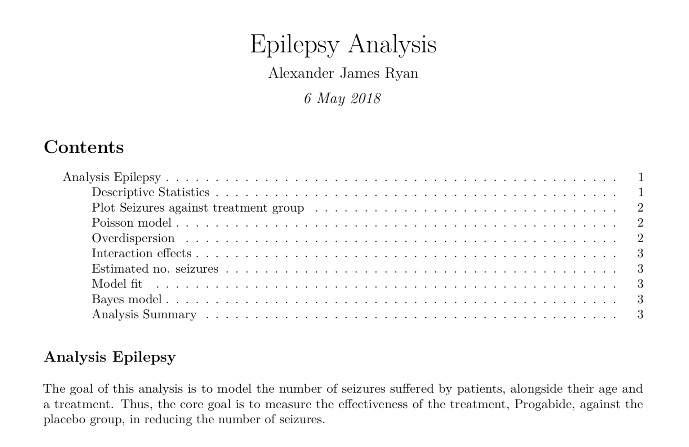

The goal of this analysis was to model the number of seizures suffered by patients, alongside their age and a treatment. Thus, the core goal was to measure the effectiveness of the treatment, Progabide, against the placebo group, in reducing the number of seizures.

You can find a copy of the paper [here](epilepsyreport.pdf)

