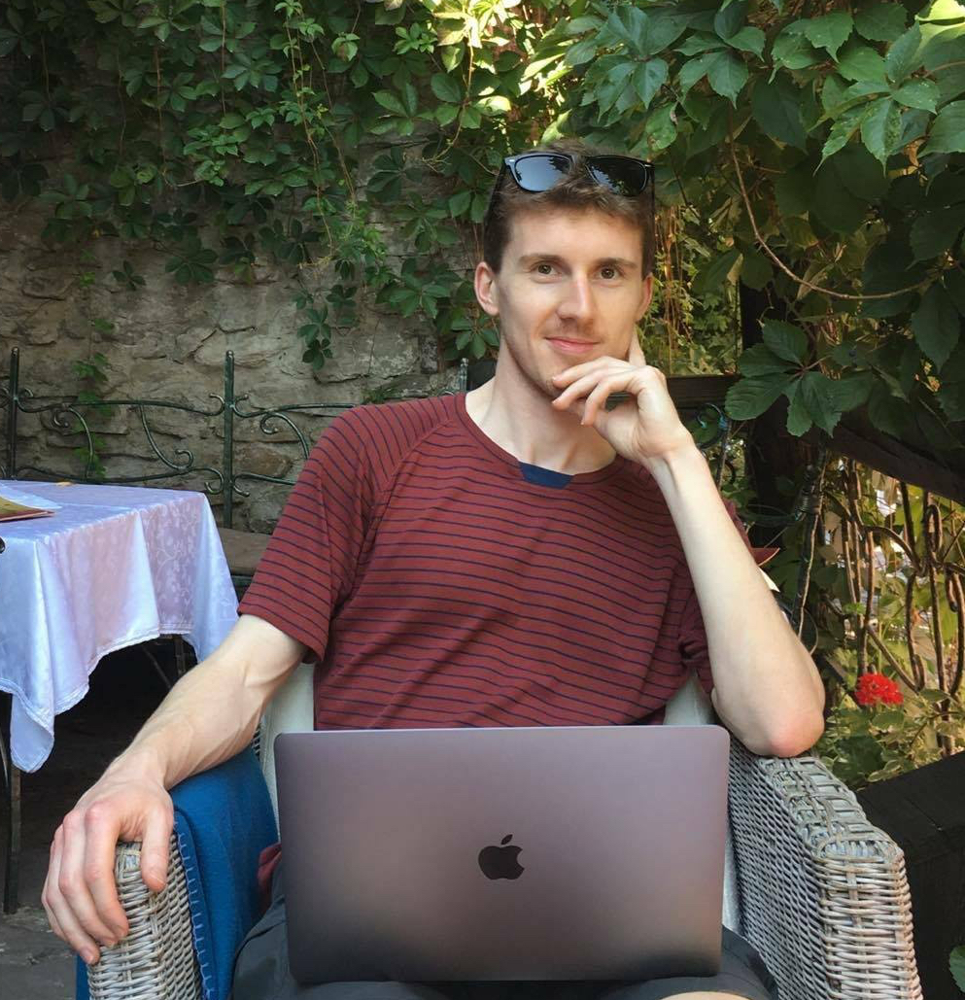

---
---

<link rel="stylesheet" href="styles.css" type="text/css">

I am a skilled Data Scientist and Product Manager. I am passionate about building awesome products, from ideation, to development, all the way through to deployment.

I began my education at the [University of Melbourne](https://www.unimelb.edu.au/), with a Bachelor of Commerce, I majored in Finance, and I also picked up subjects in Economics, Programming and Statistics. During this time I worked on a few side projects, including a website for posting reivews on subjects at universities in Melbourne. I learned that it is sometimes better to suffer a steep learning curve in the short term, than putting up with inadequate skills and tools, during the development of a project.

During the later part of my studies I started working at the [Melbourne Accelerator Program](http://themap.co/). The MAP is a startup accelerator program run by the University of Melbourne, that provides seed investment funding for startups as well as educational events, designed to promote entrepreneurial ecosystem in Melbourne. I began as an intern, then as an Associate, working on a range of educational events. Highlights include hosting a [Public Form](https://www.youtube.com/watch?v=UFx2CQUTpYo&t=165s) with Steve Blank, author of the The Startup Owner's Manual; developing the Startup Velocity Program, a Workshop series designed to assist early-stage startup founders; and being part of the MAP Investment Advisory board.

You can find a copy of my resume [here](CV_Alexander_Ryan.pdf)
