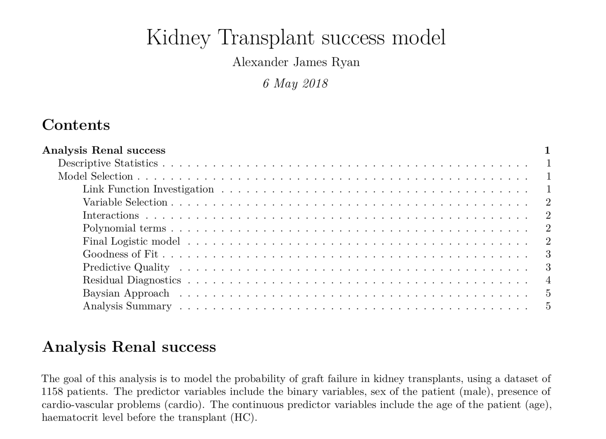

The goal of this analysis was to model the probability of graft failure in kidney transplants, using a dataset of 1158 patients. The predictor variables include the binary variables, sex of the patient (male), presence of cardio-vascular problems (cardio). The continuous predictor variables include the age of the patient (age), haematocrit level before the transplant (HC).

You can find a copy of the paper [here](logisticreport.pdf)

