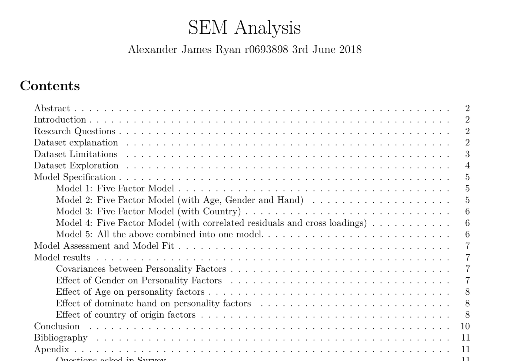

Built Structural Equation Models to estimate the psychological personality traits Extraversion, Openness, Agreeableness, Conscientiousness, and Neuroticism. 

The results derived were congruent with previous studies on personality using the Big Five Factor Personality Model

You can find a copy of the paper [here](semreport.pdf)

