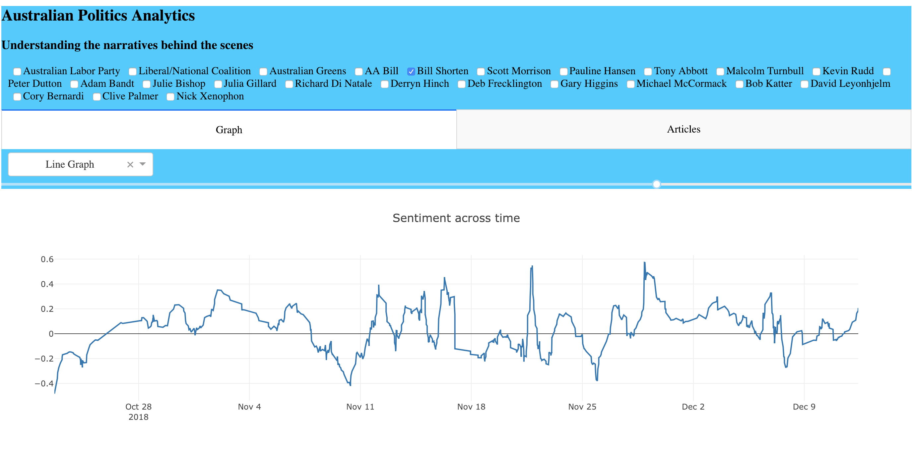

Built a web application using Dash to compare the sentiment of Australian politicians from newspaper articles

- Used API to automatically retrieve online newspaper articles on Australian politicians
- These articles are stored onto a SQLite database
- Sentiment is derived using the vaderSentiment package in Python
- The application is built with Dash to graph the sentiment across time

You can find a link to the application [here](http://165.227.131.157/).

